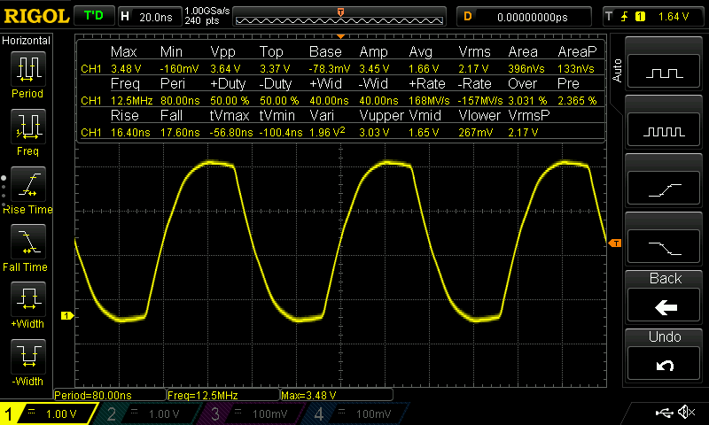
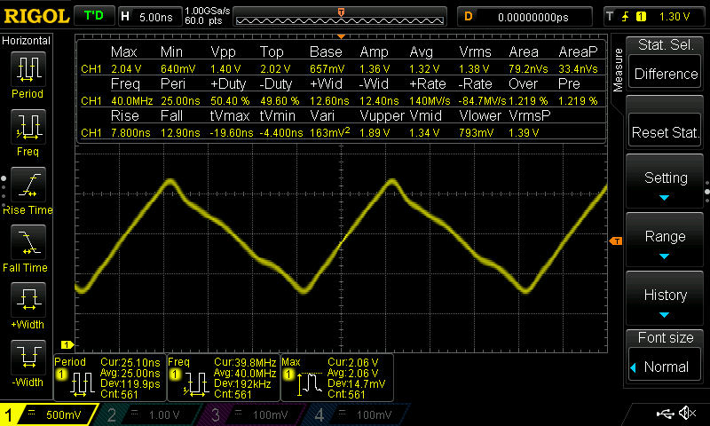
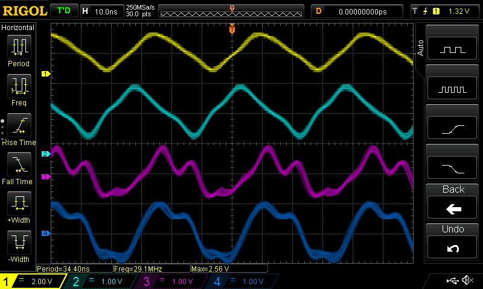
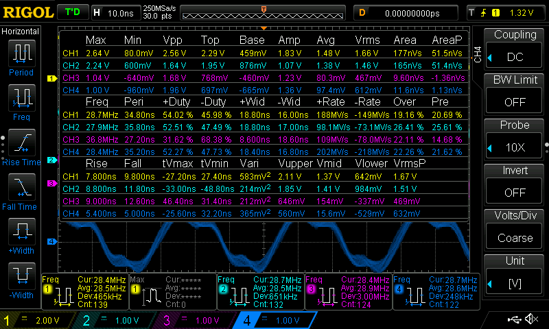
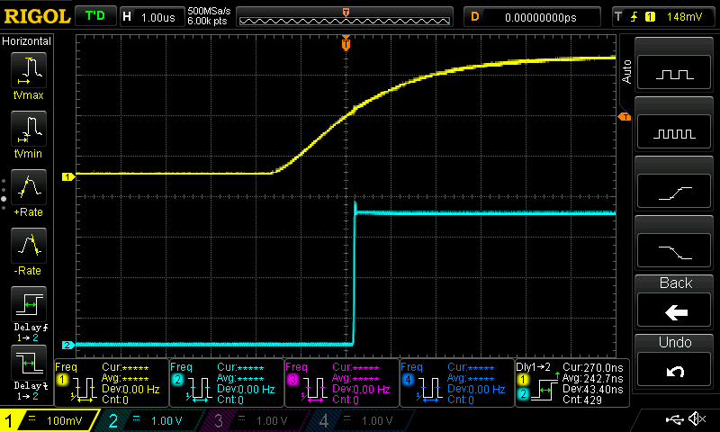
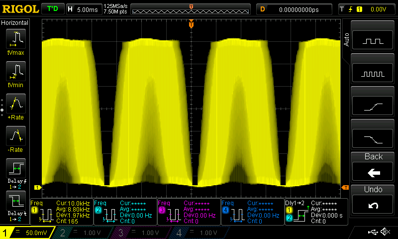

# HW09
Wesley Van Pelt - CM3289

## 2.6 Blinking an LED
Files for this part: [`blinking-an-led`](blinking-an-led)

* Max toggle speed: 12.5MHz
* Jitter: None
* Stability: Very

## 5.3 PWM Generator
I ended up using 40MHz instead of 50MHz since that was the closest I could get to it.

Files for this part: [`pwm-generator`](pwm-generator)

* Stability: Constantly changes between 39.8MHz and 40.3MHz, but the average is 40MHz
* Std Dev.: 192kHz
* Jitter: Some

## 5.4 Controlling the PWM Frequency
I'm not sure what's up with these waveforms, but it seems to be a result of having multiple channels going at once...

Files for this part: [`controlling-pwm-frequency`](controlling-pwm-frequency)

* Highest frequency with 4 channels: 28.7MHz
* Jitter: About the same as the previous part
* P8_43 has a very odd waveform

## 5.5 Loop Unrolling for Better Performance
This didn't seem to do anything for me, and I tried between 4 and 1024 loop unrolls...

Files for this part: [`loop-unrolling`](loop-unrolling)

## 5.9 Reading an Input at Regular Intervals

Files for this part: [`reading-input`](reading-input)

* Input latency:

## 5.10 Analog Wave Generator

Files for this part: [`analog-wave-gen`](analog-wave-gen)

