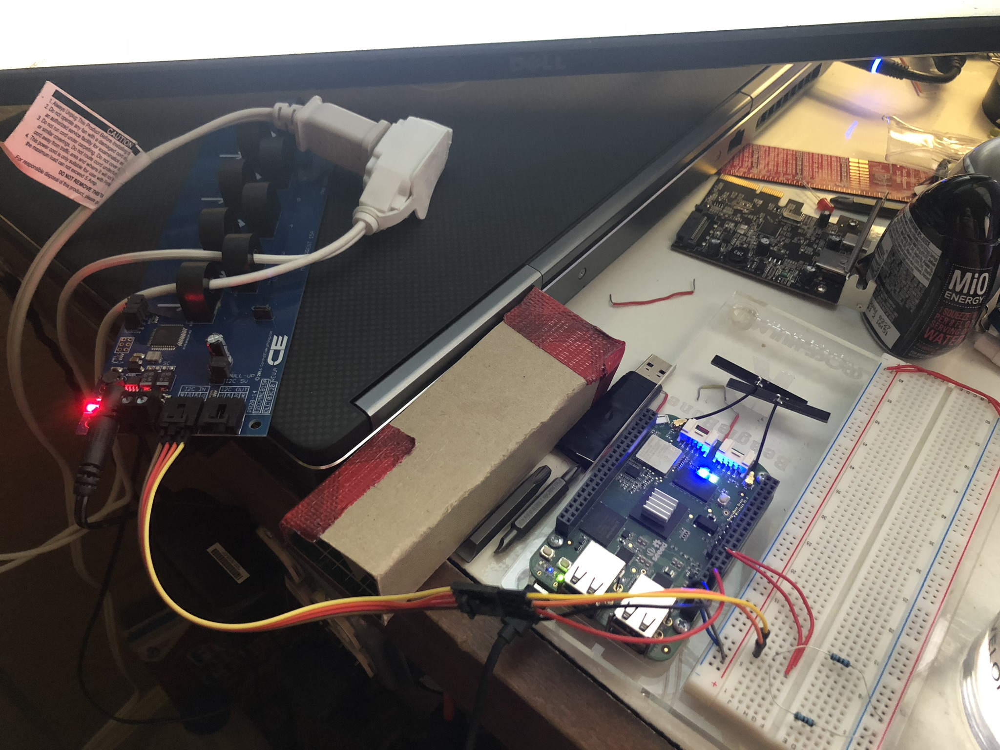

# HW10
Wesley Van Pelt - CM3289

## Project Timeline
* Sunday Oct 28 - All hardware assembled
* Sunday Nov 4  - Software working

## Logging in Sheets
I'll be using my 8-channel AC current sensor for this since I need to figure out how to use it anyway.  Here's the reference guide for it: [https://media.ncd.io/sites/2/20170721134908/Current-Monitoring-Reference-Guide-24.pdf](https://media.ncd.io/sites/2/20170721134908/Current-Monitoring-Reference-Guide-24.pdf)

Here is the Sheets Link: [https://docs.google.com/spreadsheets/d/13Hi4m2UrfbVr5Bg12nZ23ZJg0PAR5GkY8vFZzVUqUa8/edit?usp=sharing](https://docs.google.com/spreadsheets/d/13Hi4m2UrfbVr5Bg12nZ23ZJg0PAR5GkY8vFZzVUqUa8/edit?usp=sharing)

I used the first 2 channels of my current monitor monitoring the hot and neutral lines going to a fan and output them to the console and the Google Sheet.

========================
Professor Yoder's Comments

The timeline is rather course.

Nice picture of the setup.

Looks logged, but I don't see a plot.

Score:  9/10